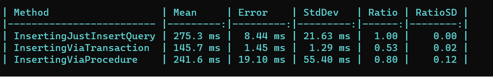
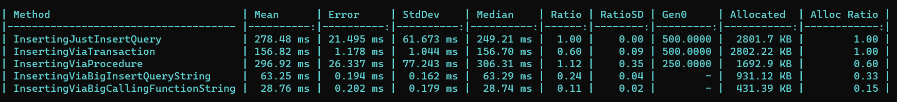

# SqlPractice
Comparing what is method work faster

Case 1 (inserting 300 rows)
- Simple insert query
- Transaction
- Postgres function

Case 2 (added big query string)
- Just a big query inserting string for each elemrnt
- Just a big query with calling inserting function on postgres

